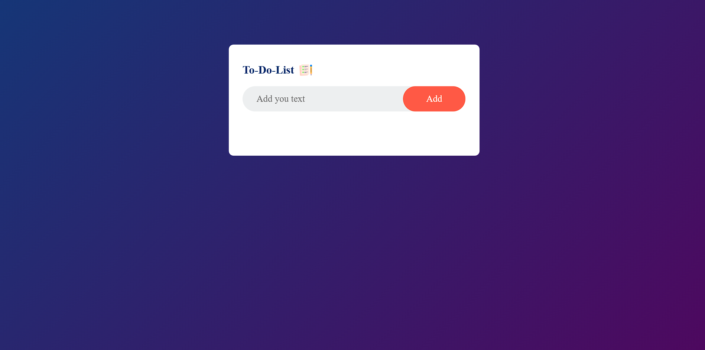
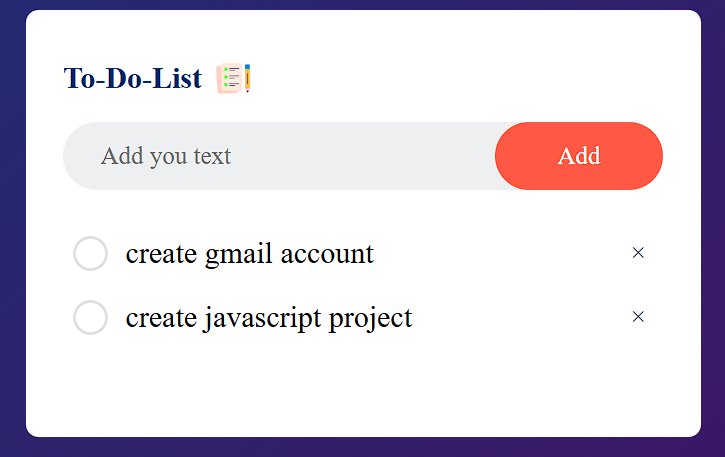
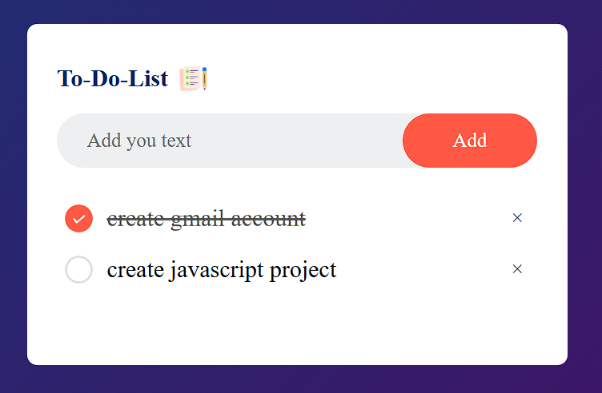

# To-Do List App 🔧📝

A simple and functional To-Do List app to help you stay organized. This project demonstrates the use of HTML, CSS, and JavaScript for building an interactive task manager with local storage support.

## Features 🌟

- Add tasks to your to-do list.
- Mark tasks as completed by clicking on them.
- Remove tasks by clicking the delete (x) button.
- Saves your tasks automatically in the browser’s local storage.
- Clean and responsive user interface.


## Installation Steps 🛠️

1. Clone the repository:
 

2. Open the `index.html` file in your browser:
   ```bash
   open index.html
   ```

## How to Use 🎩

1. Enter your task in the input field.
2. Click the "Add" button to add the task to your list.
3. Click on a task to mark it as completed or toggle it back to incomplete.
4. Click the "x" icon next to a task to delete it.

## Technology Stack 🛠️
- HTML5
- CSS3
- JavaScript (ES6+)
- Local Storage API

## Code Highlights 🎉

### Adding a Task:
```javascript
function addtask() {
    if (inputBox.value === '') {
        alert("You must write something!");
    } else {
        let li = document.createElement("li");
        li.innerHTML = inputBox.value;
        listContainer.appendChild(li);
        let span = document.createElement("span");
        span.innerHTML = "\u00d7";
        li.appendChild(span);
    }
    inputBox.value = "";
    saveData();
}
```

### Local Storage Management:
```javascript
function saveData() {
    localStorage.setItem('data', listContainer.innerHTML);
}

function showData() {
    listContainer.innerHTML = localStorage.getItem("data");
}
showData();
```

## Screenshots 🖼️

### Main Interface:


### Task Completed:




## Future Enhancements 🚀

- Add due dates and reminders for tasks.
- Drag-and-drop functionality to reorder tasks.
- Option to clear all tasks at once.
- Theme toggle (light/dark mode).

## Acknowledgments 🙏

- Icon assets by [Freepik](https://www.flaticon.com/).
- Background gradient generated using [CSS Gradient](https://cssgradient.io/).

## License 🔒

This project is licensed under the MIT License.

---

I’m a beginner coder on a mission to create and learn. Your feedback means a lot!  
Contact me at: [derkaran@gmail.com](mailto:derkaran@gmail.com)  
Connect with me on LinkedIn: [](https://www.linkedin.com/in/karan-der/)

